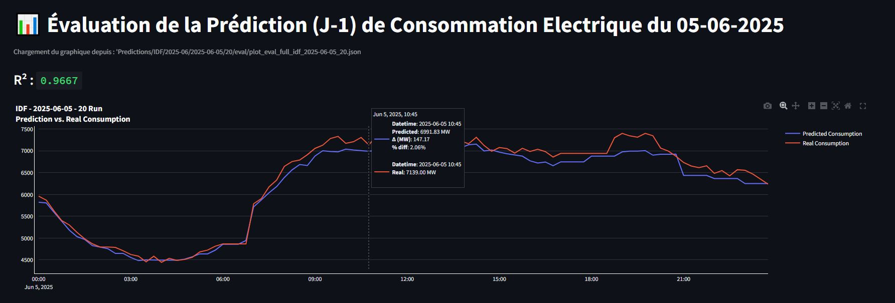
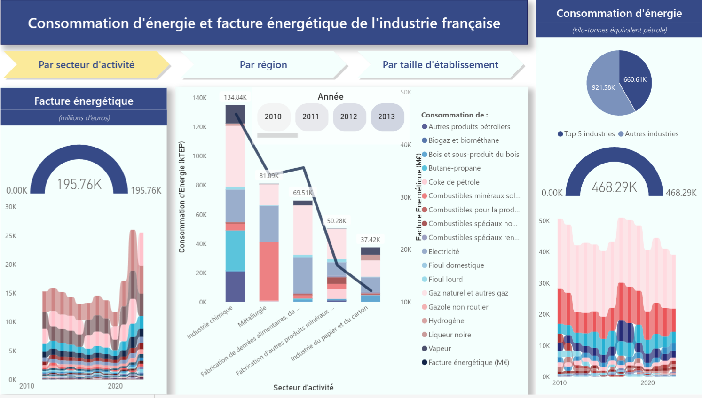

[:fr:**Version française**](./README_FR.md) | [:it:**Versione Italiana**](./README_IT.md)

---

## 📺 Video bio

---

## 🏫 Education

**RNCP 6 : Concepteur Développeur d'Applications // Bootcamp : Data Scientist (DATAROCKSTARS)**  
*2025 - Certification expected 09/2025*  
400-hour intensive Data Science bootcamp

**Masters of Science in Sustainable Agriculture (110 e Lode)**  
*Università degli Studi di Padova, Italy - 2022*

**Bachelors of Arts in Biology**  
*Carleton College, USA - 2015*

**Baccalauréat Général - SES (International Option)**  
*EABJM, Paris - 2011*

---

##📌 Projects

**🔮 1. Regional Electricity Consumption Forecasting System**

This project is a full-stack, **end-to-end, automated system** for forecasting short-term electricity consumption across all regions of France. It features a robust, scalable, and maintainable **cloud-native data pipeline** that handles the complete data lifecycle, from automated acquisition of real-time consumption and temperature data via APIs to cloud storage, model training, prediction, and evaluation. The system culminates in a **live Streamlit application** for interactive visualization of forecasts.

*   **Key Practices:** Emphasizing **automated data acquisition from external APIs**, **cloud data lake implementation (AWS S3)**, **efficient data processing and transformation** (including time-series resampling and incremental updates), **containerization with Docker**, and **automated orchestration via AWS services**. It also demonstrates a full **MLOps workflow**, including feature engineering, model management with **MLflow**, and multi-layered automated prediction and evaluation.
*   **Tech Stack:** **AWS (S3, ECS, EventBridge)**, **Docker**, **Python** (Pandas, Scikit-learn, XGBoost, Boto3, Plotly), **MLflow**, **Streamlit**, and **Render**.

🌐 **Live Demo:** [https://predi-elec.onrender.com](https://predi-elec.onrender.com)  
[📁 View Full Project Documentation](./projects/electricity-forecasting/README.md)

---

** 📊 2. French Industrial Energy Consumption (EACEI) ETL Pipeline & Analysis**

This project is a **robust, multi-stage ETL pipeline** designed to ingest, clean, and structure **164 highly heterogeneous raw data files** (XLS, XLSX) of French industrial energy consumption data from 2010 to 2023. The core objective was to transform this complex dataset into a **clean, unified, and analysis-ready star-schema database**, which then served as the foundation for an interactive **Power BI dashboard** to analyze energy trends.

*   **Key Practices:** This project showcases **advanced data quality management** (handling varying file formats, standardizing diverse dimensions like business sectors, regions, and employee sizes, and addressing suppressed data), **data modeling with a star schema**, **modularity**, **configuration as code (JSON)**, and **robust error handling** throughout the ETL process.
*   **Tech Stack:** **Python**, **Pandas**, **JSON**, CSV outputs, and **Microsoft Power BI**.

[📁 View Full Project Documentation](./projects/eacei-etl/README.md)

---

** 🚄 3. E-commerce Real-Time Analytics Platform (Ongoing)**

This **ongoing project**, focused on **Big Data** concepts, simulates an end-to-end e-commerce analytics platform, processing both batch and streaming user interaction events, storing them in a data lake, loading to a data warehouse, and transforming them for analytics. The platform emphasizes **scalability, data quality, error handling, and real-world resilience**.

*   **Key Practices:** The project amplifies **Big Data aspects** through volume/velocity simulation, partitioning, and streaming. It incorporates **robust data quality checks (Great Expectations)**, **enhanced error handling and monitoring**, **idempotency**, **schema evolution**, and a **simple query/serving layer** for end-to-end completeness. It also includes **CI/CD basics** and a **scalability demo** to showcase thoughtful engineering practices.
*   **Tech Stack:** **Kafka**, **Spark**, **Airflow**, **Snowflake**, **PostgreSQL**, **DBT**, **Great Expectations**, **S3**, **Docker**, **FastAPI**, and **GitHub Actions**.

[📁 View Full Project Documentation](./projects/ecommerce-analytics/README.md)

---

## Professional Experience

**Data Engineer**  
*Prediction of regional electricity consumption project (2025)*
- Data collection and preparation: aggregation of multiple sources (APIs, static files), cleaning and structuring
- Modeling & Continuous improvement: construction and versioning (MLflow) of 55 predictive models (XGBoost) with performance tracking
- Production deployment: fully automated data pipeline with Docker and AWS (S3, ECS, EventBridge)
- Reporting & Visualization: creation of an interactive dashboard (Streamlit) for prediction tracking and result analysis by users

**Agronomy Projects Engineer - Agrivoltaics**  
*SOLVEO Energies (renewable energy developer) - Toulouse*  
*July 2024 - January 2025*
- Agronomic interface for field development teams: conducting farm diagnostics and writing technical decision-support notes
- Writing functional specifications for the development of the company's agrivoltaic management software
- Creation of a reference database on light requirements for 17 crops, based on a synthesis of over 70 scientific articles

**Business Engineer**  
*MYCOPHYTO SAS (French Tech startup) - Grasse (PACA)*  
*August 2023 - November 2023*
- Managing client relationships from prospecting to field deployment: technical presentations, commercial proposals, and agronomic monitoring (sampling, report production)
- Improvement of sales support and reporting tools: redesign of pricing tool (advanced Excel formulas) and development of cartographic visualization tool (QGIS) for client deliverables

**Account Manager / Commercial - Technical Projects**  
*Domaine La Tourbeille // Taverne du Belvédère - Bordeaux region*  
*2017 - 2023*
- B2B sales, budget management, commercial strategy
- Restaurant operations management  
- Implementation of agroecological practices in the vineyard

---

## Technical Skills

**Languages & Data Processing:**  
Python, SQL, Pandas, NumPy, Scikit-learn, Jupyter

**Industrialization & MLOps:**  
Docker, AWS S3/ECS, Git/GitLab, MLflow, Streamlit - interactive dashboards

**Methods & Practices:**  
Predictive modeling, Feature engineering, Exploratory analysis, Software testing, Agile principles

**Languages:**  
English/French (native and bilingual), Italian (fluent ~ C1), Spanish (B1), German (A2), Japanese (A2), Arabic (A2)

---

## Contact

📧 **Email:** henrisandifer@gmail.com  
📍 **Location:** Toulouse, France (willing to relocate)  
🔗 **GitHub:** [github.com/henrisandifer](https://github.com/henrisandifer)

---

*Data Engineer passionate about solving business problems, with a particular appetite for designing and deploying end-to-end data pipelines. Former agronomist engineer specialized in soil microbiology, I combine scientific rigor and technical skills (Python, SQL, Docker, AWS) to transform data into concrete solutions.*
