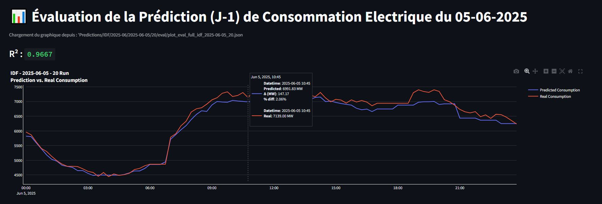
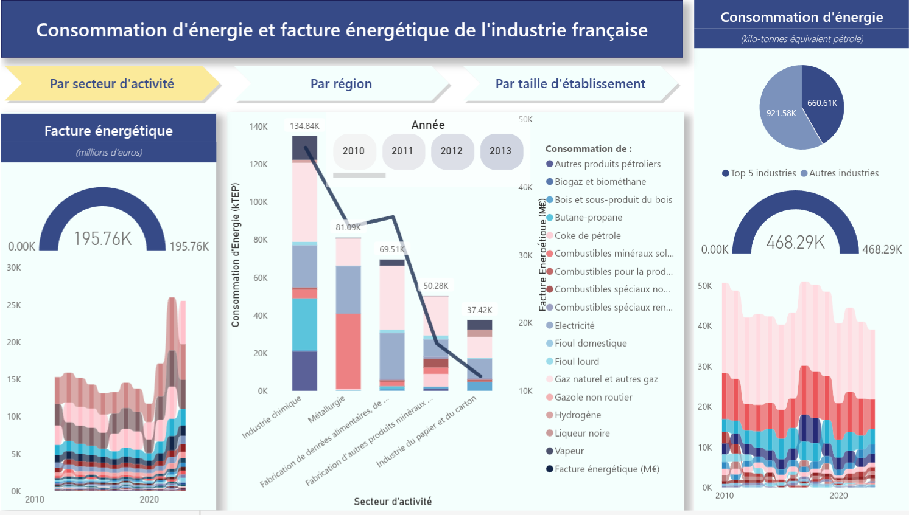

[🇫🇷 **Version française**](./pages/README_FR.markdown) | [🇮🇹 **Versione Italiana**](./pages/README_IT.markdown)

# Data Engineer

  

    
🌍 <strong>Spoken languages</strong> (fluent)

    

      English
      French
      Italian
    

  

  

    
🧱 <strong>Tech stack</strong>

    

      Python
      SQL
      Bash
      AWS S3/ECS
      Power BI
      Streamlit
    

  

  

    
🎯 <strong>Skills</strong>

    

      ETL/ELT
      Data modelling
      Data quality
      Error logging & Monitoring
      Unit/Integration Testing
    

  

---

## 📺 Video presentation
<!-- -->
⌛ **_Coming soon_**

_Problem-solver and ex-microbiologist/agronomist with a knack for building, maintaining and optimizing data infrastructure._

---

## 🎓 Education

*   **RNCP 6, Concepteur Développeur d'Applications**
  *Bootcamp : Data Scientist (DATAROCKSTARS) - 09/2025* 

*   **M.S., Sustainable Agriculture**  
  *Università degli Studi di Padova, Italy - 2022*

*   **B.A., Biology**  
  *Carleton College, USA - 2015*

*   **French Baccalaureate - Economics and Sociology (International Option)**  
  *EABJM, Paris - 2011*

---

## 📌 Projects

### **🔮 1. Regional Electricity Consumption Forecasting System**

Full-stack, **end-to-end, automated system** for forecasting short-term electricity consumption across all regions of France. Robust, scalable, and maintainable **cloud-native data pipeline** that handles the complete data lifecycle, from automated acquisition of real-time consumption and temperature data via APIs to cloud storage, model training, prediction, and evaluation. Culminates in a **live Streamlit application** for interactive visualization of forecasts.

*   **Key Practices:** **Automated data acquisition from external APIs**, **cloud data lake implementation (AWS S3)**, **efficient data processing and transformation** (including time-series resampling and incremental updates), **containerization with Docker**, and **automated orchestration via AWS services**. Full **MLOps workflow**, including feature engineering, model management with **MLflow**, and multi-layered automated prediction and evaluation.
*   **Tech Stack:** **AWS (S3, ECS, EventBridge)**, **Docker**, **Python** (Pandas, Scikit-learn, XGBoost, Boto3, Plotly), **MLflow**, **Streamlit**, and **Render**.

### 👉🌐 View the **Live Demo** : [https://predi-elec.onrender.com](https://predi-elec.onrender.com) 

### 👉📖 View the Full **Project Report** (+ video) : [Full Project Report](./pages/Predi_Elec_2.md)

---

### **📊 2. French Industrial Energy Consumption (EACEI) ETL Pipeline & Analysis**

This project is a **robust, multi-stage ETL pipeline** designed to ingest, clean, and structure **164 highly heterogeneous raw data files** (XLS, XLSX) of French industrial energy consumption data from 2010 to 2023. The core objective was to transform this complex dataset into a **clean, unified, and analysis-ready star-schema database**, which then served as the foundation for an interactive **Power BI dashboard** to analyze energy trends.

*   **Key Practices:** This project showcases **advanced data quality management** (handling varying file formats, standardizing diverse dimensions like business sectors, regions, and employee sizes, and addressing suppressed data), **data modeling with a star schema**, **modularity**, **configuration as code (JSON)**, and **robust error handling** throughout the ETL process.
*   **Tech Stack:** **Python**, **Pandas**, **JSON**, CSV outputs, and **Microsoft Power BI**.

### 👉🌐 View the **Live Dashboard:** [Power BI Dashboard](https://app.powerbi.com/view?r=eyJrIjoiZTE4YjVhMjctZjFmZS00YjRjLThlOTctNDAyOGI0ZTNiNGNiIiwidCI6ImJlOTNmMTc4LTA5NjQtNDcwOS1hMDZjLTY4ZThhZjBhODM1NSJ9&pageName=f779d68dcac6fc795d20) 

### 👉📖 View the Full **Project Report** (+ video) : [Full Project Report](./pages/EACEI.md)

---

### **💻 3. E-commerce Real-Time Analytics Platform (Ongoing)**

This **ongoing project**, focused on **Big Data** concepts, simulates an end-to-end e-commerce analytics platform, processing both batch and streaming user interaction events, storing them in a data lake, loading to a data warehouse, and transforming them for analytics. The platform emphasizes **scalability, data quality, error handling, and real-world resilience**.

*   **Key Practices:** The project amplifies **Big Data aspects** through volume/velocity simulation, partitioning, and streaming. It incorporates **robust data quality checks (Great Expectations)**, **enhanced error handling and monitoring**, **idempotency**, **schema evolution**, and a **simple query/serving layer** for end-to-end completeness. It also includes **CI/CD basics** and a **scalability demo** to showcase thoughtful engineering practices.
*   **Tech Stack:** **Kafka**, **Spark**, **Airflow**, **Snowflake**, **PostgreSQL**, **DBT**, **Great Expectations**, **S3**, **Docker**, **FastAPI**, and **GitHub Actions**.

### 👉📝 View the Ongoing Project Documentation : [Ongoing Project Documentation](./pages/E_commerce.md)

---

## 🧰 Professional Experience

### **Agronomy Projects Engineer - Agrivoltaics**  
*SOLVEO Energies (renewable energy developer) - Toulouse*  
*July 2024 - January 2025*
   - Agronomic interface for field development teams: conducting farm diagnostics and writing technical decision-support notes
   - Writing functional specifications for the development of the company's agrivoltaic management software
   - Creation of a reference database on light requirements for 17 crops, based on a synthesis of over 70 scientific articles

### **Business Engineer**  
*MYCOPHYTO SAS (French Tech startup) - Grasse (PACA)*  
*August 2023 - November 2023*
   - Managing client relationships from prospecting to field deployment: technical presentations, commercial proposals, and agronomic monitoring (sampling, report production)
   - Improvement of sales support and reporting tools: redesign of pricing tool (advanced Excel formulas) and development of cartographic visualization tool (QGIS) for client deliverables

### **Account Manager / Owner**  
*Domaine La Tourbeille // Taverne du Belvédère - Bordeaux region*  
*2017 - 2023*
   - B2B sales, budget management, commercial strategy
   - Restaurant operations management  
   - Implementation of agroecological practices in the vineyard
