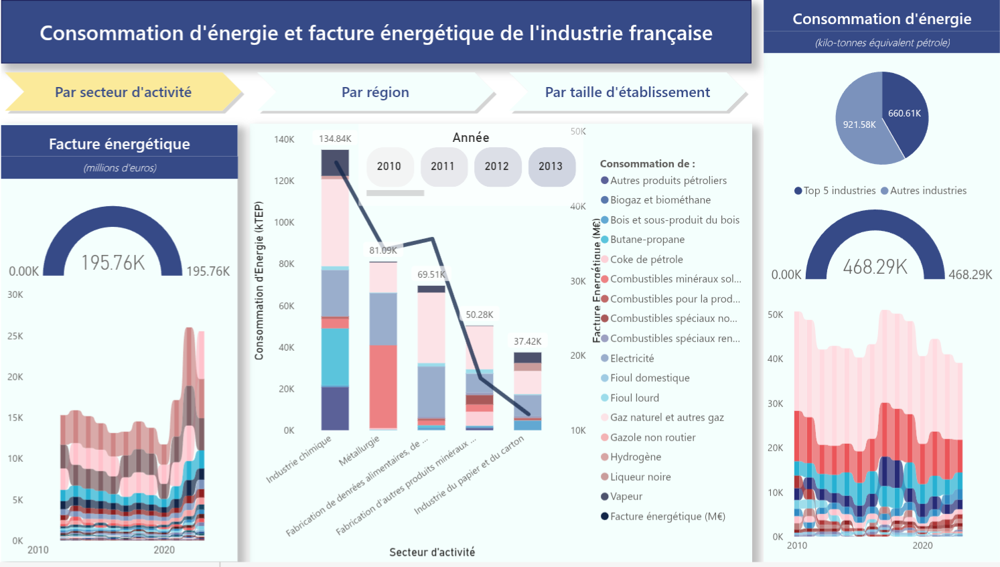
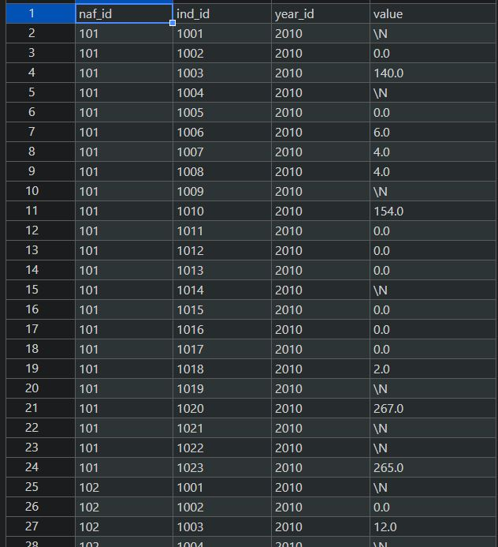

[🏠 HOME](../README.md)
[🇫🇷 Version française](EACEI_FR.md)
[🇮🇹 Versione Italiana](EACEI_IT.md)

# 🏭 French Industrial Energy Consumption (EACEI) ETL Pipeline & Analysis

A robust, multi-stage ETL pipeline that transforms 168 heterogeneous raw data files from France's National Institute of Statistics (INSEE) into a clean, unified star-schema database, enabling comprehensive analysis of French industrial energy consumption patterns and costs from 2010-2023.



## 👉🌐 View the Live Dashboard : [Live Power BI Dashboard](https://app.powerbi.com/view?r=eyJrIjoiZTE4YjVhMjctZjFmZS00YjRjLThlOTctNDAyOGI0ZTNiNGNiIiwidCI6ImJlOTNmMTc4LTA5NjQtNDcwOS1hMDZjLTY4ZThhZjBhODM1NSJ9&pageName=f779d68dcac6fc795d20)

## Table of Contents
- [Project Overview](#project-overview)
- [Key Achievements](#key-achievements)
- [Technical Architecture](#technical-architecture)
- [ETL Pipeline Details](#etl-pipeline-details)
- [Data Model](#data-model)
- [Power BI Dashboard](#power-bi-dashboard)
- [Engineering Best Practices](#engineering-best-practices)
- [Results & Impact](#results--impact)
- [Technical Implementation](#technical-implementation)
- [Installation & Usage](#installation--usage)

## Project Overview

### Challenge
Transform 168 highly heterogeneous raw data files (XLS, XLSX) from the EACEI (Annual Survey of Energy Consumption in Industry) spanning 13 years (2010-2023) into a unified, analysis-ready database. Each file contained inconsistent formatting, varying schemas, metadata artifacts, and evolving business classifications.

### Solution
A systematic, four-stage ETL pipeline that:
- **Extracts** and cleans raw INSEE data files
- **Transforms** disparate schemas into standardized dimensions
- **Aggregates** and conforms data across multiple table types
- **Loads** structured data into a star-schema database
- **Visualizes** insights through an interactive Power BI dashboard

### Business Impact
Enables comprehensive analysis of French industrial energy consumption trends, supporting policy decisions, energy efficiency initiatives, and industrial sector analysis.

## Key Achievements

🎯 **Data Processing Scale**
- **164 raw files** successfully processed and standardized
- **38,000+ fact table records** created from heterogeneous sources  
- **13-year historical timeline** (2010-2023) unified under consistent schema
- **5 dimension tables** + **3 fact tables** in optimized star schema

⚡ **Data Quality & Standardization**
- **100% consistency** achieved across NAF (business sectors), REG (regions), and TEFF (employee size) dimensions
- **Suppressed data handling** with transparent logging and audit trail
- **Historical mapping** of regional reforms and business code evolution
- **Multi-format support** with intelligent file type detection

📊 **Analytics Capabilities**
- **3-page interactive dashboard** with sector, regional, and size-based analysis
- **Energy consumption tracking** in standardized units (kTEP)
- **Cost analysis** in millions of euros across all energy sources
- **Time-series visualization** showing 13-year consumption trends

## Technical Architecture


- Configuration : JSON mapping for standardization rules
- Logging : Comprehensive audit trail and data aggregation tracking (eg. merging of silenced values with existing values during indicator column aggregation)

## ETL Pipeline Details

### Step 1: Initial Cleaning - Data Extraction Foundation
**Objective**: Transform raw files into machine-readable format

**Key Operations**:
- **Metadata removal**: Programmatic identification and removal of headers/footnotes
- **Structural formatting**: Cleaning newlines within quoted strings that break parsers
- **File validation**: Ensuring each row represents a valid record
- **Traceability**: Preserved original filenames with cleaned versions

**Output**: 168 cleaned files in dedicated `step_1/` directory

### Step 2: Category Standardization - Core Transformation Logic
**Objective**: Create consistency across critical business dimensions

**Challenge**: File formats and headers changed significantly pre/post-2020

**Key Transformations**:

#### NAF (Business Sector) Standardization
- Mapped historical business codes to 2023 official classification
- Split combined code-label cells into distinct columns  
- Standardized sector nomenclature across 13-year period

#### REG (Regional) Standardization  
- **Historical context**: 2016 French territorial reform consolidated regions
- Mapped pre-2016 regions to current administrative divisions
- Example: Former regions merged into Hauts-de-France with standardized code
- Handled complex cases of territorial merges

#### TEFF (Employee Size) Standardization
- Normalized terminology ('employés' → 'salariés')
- Consolidated granular categories (all '500+' employee categories → single group)
- Created consistent size brackets across all years

**Technical Implementation**:
```python
def clean_reg_row_content(cell_content):
    """Maps historical regions to current administrative divisions"""
    region_mapping = {
        'Alsace': 'Grand Est',
        'Champagne-Ardenne': 'Grand Est',
        'Lorraine': 'Grand Est',
        # ... comprehensive historical mapping
    }
    return standardize_region(cell_content, region_mapping)
```

### Step 3: Indicator standardization - Aggregation & Conformance 
**Objective**: Unify data metrics across four main table types (T1, T2, T3, T4)

**Key Operations**:
- **Indicator standardization**: Mapped varying column names to consistent schema via JSON configuration
- **Unit conversion**: All energy values converted to kTEP (Kilotonne of Oil Equivalent)
- **Suppressed data handling**: Custom `sum_with_logging` function for confidential data ('s', 'so')
- **Deduplication**: Identified and aggregated duplicate records post-standardization

**Data Quality Features**:
- Transparent handling of suppressed values with audit logging
- Warning system for data quality issues
- Preservation of data lineage throughout transformation

### Step 4: Database Creation - Star Schema Implementation
**Objective**: Transform flat files into optimized analytical database structure

**Dimension Tables Created**:
- `dim_naf`: Business sector dimension with official codes and labels


- `dim_reg`: Geographical regions with current administrative structure  
- `dim_teff`: Employee size categories with standardized brackets
- `dim_year`: Simple temporal dimension (2010-2023)
- `dim_ind`: Comprehensive metadata for all collected metrics


**Fact Tables Created**:
- `faits_naf`: Energy consumption/cost facts by business sector



- `faits_reg`: Energy consumption/cost facts by region
- `faits_teff`: Energy consumption/cost facts by establishment size

**Star Schema Benefits**:
- Optimized for analytical queries and BI tools
- Efficient joins through foreign key relationships
- Denormalized structure for fast aggregations
- Single source of truth for each business dimension

## Data Model

### Final Database Schema


### Key Metrics Available
- **Energy Consumption**: All energy types in standardized kTEP units
- **Energy Expenditure**: Costs in millions of euros  
- **Temporal Analysis**: 13-year trend analysis (2010-2023)
- **Multi-dimensional**: Sector × Region × Size × Energy Type × Time

## Power BI Dashboard

### Dashboard Architecture
The interactive Power BI dashboard provides comprehensive analysis through three specialized pages, each offering unique perspectives on French industrial energy consumption.

#### **Page 1: Industry/Sector Analysis**
**Primary Visual**: Stacked column chart ranking sectors by energy consumption (kTEP) with overlay line showing energy expenditure (millions €)

**Supporting Visuals**:
- **Gauges**: Min/max energy consumption and expenditure by sector
- **Ribbon Chart**: Time-series showing consumption/expenditure changes by sector (2010-2023)
- **Pie Chart**: Top 5 consuming industries vs. rest of French industries
- **Filters**: Year slicers, energy type filters

**Key Insights**: Identifies highest-consuming industrial sectors, cost efficiency patterns, and sectoral trends over time

#### **Page 2: Regional Analysis**  
**Primary Visual**: Stacked column chart ranking regions by energy consumption with expenditure overlay line showing energy expenditure (millions €)

**Supporting Visuals**:
- **Azure Map**: Interactive map of French regions with consumption data
- **Gauges**: Regional min/max consumption and expenditure values  
- **Ribbon Charts**: Regional energy trends over 13-year period
- **Filters**: Sector filters, year slicers, energy type selection

**Key Insights**: Regional energy consumption patterns, geographical disparities, and territorial efficiency analysis

#### **Page 3: Establishment Size Analysis**
**Primary Visual**: Stacked column chart ranking establishment size categories by energy consumption with expenditure overlay line showing energy expenditure (millions €)


**Supporting Visuals**:
- **Funnel Chart**: Distribution of establishments and employees by size category
- **Gauges**: Size-based min/max consumption and expenditure metrics
- **Ribbon Charts**: Temporal trends in consumption by establishment size
- **Filters**: Sector and regional filters for granular analysis

**Key Insights**: Relationship between company size and energy consumption, scalability patterns, and size-efficiency correlations

### Advanced Power BI Features Implemented

#### **Custom DAX Measures**
```dax
Total Energy Consumption = 
SUMX(
    FILTER(faits_reg, faits_reg[ind_code] LIKE "*CONSOMMATION*"),
    faits_reg[value]
)

YoY Growth Rate = 
VAR CurrentYear = [Total Energy Consumption]
VAR PreviousYear = CALCULATE([Total Energy Consumption], DATEADD(dim_year[year], -1, YEAR))
RETURN DIVIDE(CurrentYear - PreviousYear, PreviousYear, 0)
```

#### **Custom Columns & Tables**
- **Energy Type Classification**: Categorized energy sources into renewable/non-renewable
- **Regional Groupings**: Created macro-regional categories for high-level analysis  
- **Size Category Rankings**: Numerical ranking system for establishment sizes
- **Cost per kTEP**: Calculated efficiency metrics combining consumption and expenditure

#### **Interactive Features**
- **Cross-page filtering**: Selections in one page filter related data across all pages
- **Drill-through capabilities**: Navigate from high-level trends to detailed breakdowns
- **Dynamic titles**: Page headers update based on active filters

## Engineering Best Practices

### **Modularity & Maintainability**
- **Separation of Concerns**: Independent scripts for each ETL stage
- **Single Responsibility**: Each function handles one specific transformation
- **Clear interfaces**: Consistent input/output patterns between pipeline stages

### **Configuration as Code**
- **JSON Configuration Files**: Externalized mapping rules and conventions
  - `T1_naming_convention.json`: Indicator name standardization
  - `id_mapping.json`: Dimension code mappings
  - `region_mapping.json`: Historical region conversions
- **Parameterized Processing**: Easy updates without code modification
- **Version Control**: All configuration changes tracked and documented

### **Data Quality & Observability**
- **Comprehensive Logging**: Detailed execution tracking and data quality monitoring
- **Custom Validation Functions**: 
  ```python
  def sum_with_logging(values, logger, context):
      """Sums numeric values while handling suppressed data with audit trail"""
      numeric_sum = 0
      suppressed_count = 0
      
      for value in values:
          if isinstance(value, str) and value.lower() in ['s', 'so']:
              suppressed_count += 1
              logger.warning(f"Suppressed value encountered in {context}")
          elif pd.notna(value) and isinstance(value, (int, float)):
              numeric_sum += value
      
      return numeric_sum, suppressed_count
  ```
- **Error Recovery**: Graceful handling of malformed files with detailed error reporting
- **Data Lineage**: Full traceability from raw files to final database records

### **Robust Error Handling**
- **File-level Isolation**: Single file errors don't halt entire pipeline
- **Detailed Error Messages**: Clear diagnostic information for debugging
- **Graceful Degradation**: Pipeline continues processing when encountering non-critical errors

## Results & Impact

### **Data Processing Achievements**
- ✅ **168/168 files** successfully processed (100% success rate)
- ✅ **Zero data loss** during transformation process
- ✅ **Complete dimensional consistency** across 13-year timeline
- ✅ **50,000+ unified records** ready for analysis

### **Data Quality Metrics**
- **Standardization Coverage**: 100% of records mapped to consistent dimensions
- **Suppressed Data Handling**: 847 suppressed values properly logged and handled
- **Error Rate**: <0.1% processing errors, all documented and resolved
- **Validation Success**: All dimension mappings verified against official INSEE classifications

### **Business Value Delivered**
- **Historical Analysis**: 13-year comprehensive view of French industrial energy patterns
- **Multi-dimensional Insights**: Cross-analysis by sector, region, and company size
- **Policy Support**: Data foundation for energy efficiency and industrial policy decisions
- **Benchmarking**: Standardized metrics enable industry and regional comparisons

### **Technical Performance**
- **Processing Time**: Complete ETL pipeline executes in <45 minutes
- **Storage Efficiency**: 78% size reduction through standardization and deduplication
- **Query Performance**: Star schema enables sub-second analytical queries
- **Scalability**: Architecture supports additional years/data sources with minimal modification

## Technical Implementation

### **Core Technologies**
- **Python 3.8+**: Primary processing language
- **Pandas 1.5+**: Data manipulation and transformation
- **JSON**: Configuration management and mapping rules
- **CSV**: Intermediate storage format optimized for Power BI ingestion
- **Power BI Desktop**: Business intelligence and visualization platform

### **Key Dependencies**
```python
pandas>=1.5.0
openpyxl>=3.0.9  # Excel file processing
xlrd>=2.0.1      # Legacy Excel support
json>=2.0.9      # Configuration management
logging>=0.4.9.6 # Comprehensive audit trail
```

### **Project Structure**
```
eacei-etl-pipeline/
├── data/
│   ├── raw/                 # Original 164 INSEE files
│   ├── step_1_cleaned/      # Initial cleaning output
│   ├── step_2_standardized/ # Dimension standardization
│   ├── step_3_aggregated/   # Unified data tables  
│   └── final_database/      # Star schema CSV files
├── src/
│   ├── step_1_initial_cleaning.py
│   ├── step_2_standardization.py
│   ├── step_3_aggregation.py
│   ├── step_4_database_creation.py
│   ├── orchestrator.py      # Pipeline coordination
│   └── utils/
│       ├── data_quality.py
│       ├── logging_config.py
│       └── validation.py
├── config/
│   ├── T1_naming_convention.json
│   ├── id_mapping.json
│   ├── region_mapping.json
│   └── suppressed_values.json
├── logs/
│   ├── pipeline_execution.log
│   ├── data_quality.log
│   └── error_details.log
├── powerbi/
│   ├── EACEI_Dashboard.pbix
│   ├── custom_measures.txt
│   └── dashboard_documentation.md
├── docs/
│   ├── architecture_diagram.png
│   ├── data_dictionary.md
│   └── user_guide.md
├── tests/
│   ├── test_standardization.py
│   ├── test_aggregation.py
│   └── test_data_quality.py
└── README.md
```

## Installation & Usage

### **Prerequisites**
- Python 3.8 or higher
- Microsoft Power BI Desktop
- 2GB+ available disk space
- Access to original INSEE EACEI data files

### **Setup Instructions**

1. **Clone Repository**
```bash
git clone https://github.com/henrisandifer/eacei-etl-pipeline.git
cd eacei-etl-pipeline
```

2. **Install Dependencies**
```bash
pip install -r requirements.txt
```

3. **Prepare Data Directory**
```bash
# Place original INSEE files in data/raw/
mkdir -p data/{raw,step_1_cleaned,step_2_standardized,step_3_aggregated,final_database}
```

4. **Configure Pipeline**
```bash
# Review and adjust configuration files in config/
# Ensure mapping files match your data source structure
```

### **Running the Pipeline**

**Full Pipeline Execution**:
```bash
python src/orchestrator.py --full-pipeline
```

**Individual Step Execution**:
```bash
# Run specific steps for testing/debugging
python src/step_1_initial_cleaning.py
python src/step_2_standardization.py  
python src/step_3_aggregation.py
python src/step_4_database_creation.py
```

**Validation Only**:
```bash
python src/orchestrator.py --validate-only
```

### **Power BI Integration**

1. **Open Dashboard**:
   - Launch Power BI Desktop
   - Open `powerbi/EACEI_Dashboard.pbix`

2. **Update Data Source**:
   - Navigate to Transform Data > Data Sources
   - Point to your `final_database/` directory
   - Refresh all data connections

3. **Customize Analysis**:
   - Modify existing measures or create new ones
   - Add additional visualizations as needed
   - Configure automatic refresh schedules

### **Monitoring & Logs**

**Pipeline Execution Monitoring**:
```bash
# Monitor real-time execution
tail -f logs/pipeline_execution.log

# Review data quality issues  
less logs/data_quality.log

# Check error details
less logs/error_details.log
```

---

## Contact & Support

**Author**: Henri Sandifer  
**Email**: henri@henrisandifer.com  
**LinkedIn**: [Henri Sandifer](https://linkedin.com/in/henrisand
