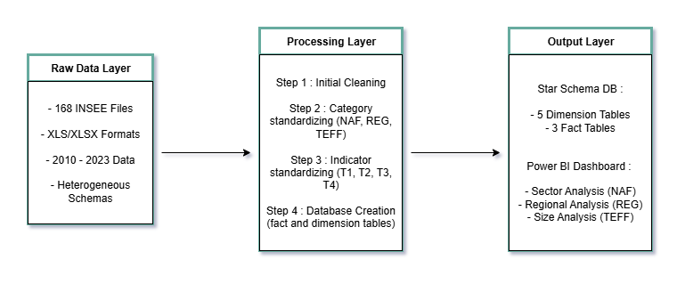
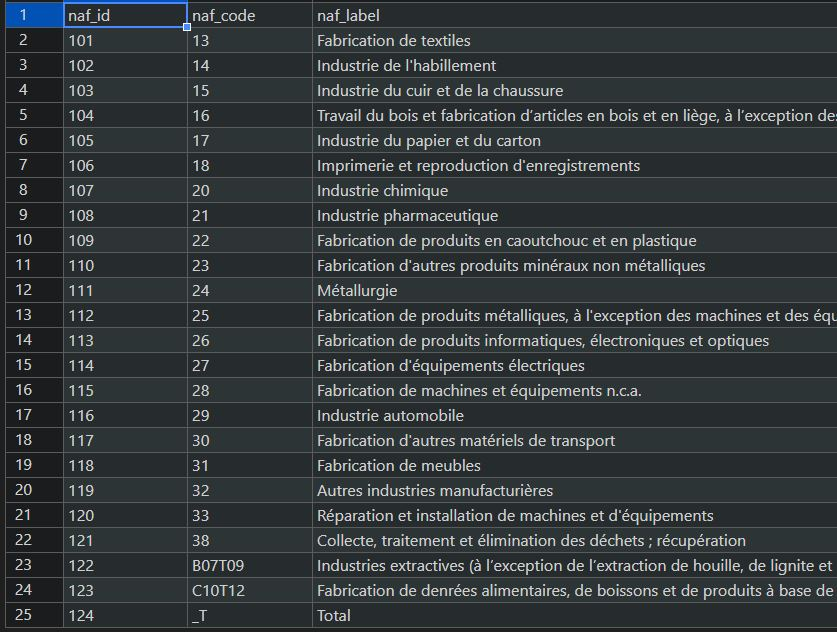
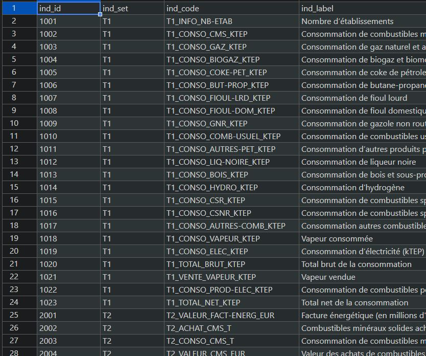
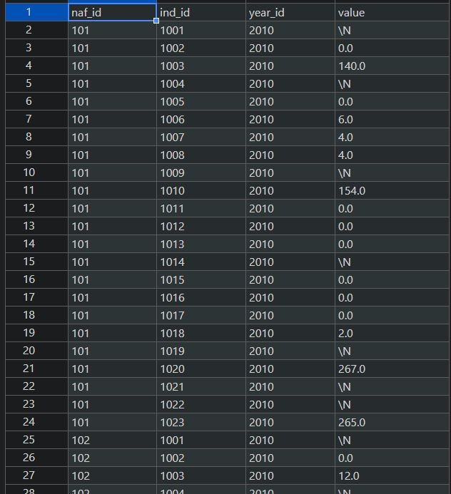

[🏠 ACCUEIL](../README.md)
[🇬🇧 English version](EACEI.md)
[🇮🇹 Versione Italiana](EACEI_IT.md)

# 🏭 Pipeline ETL & Analyse de la Consommation d'Énergie dans l'Industrie Française (EACEI)

Un pipeline ETL robuste et multi-étapes qui transforme 168 fichiers de données brutes hétérogènes de l'INSEE en une base de données propre, unifiée et en schéma en étoile, permettant une analyse complète des modèles et des coûts de consommation d'énergie de l'industrie française de 2010 à 2023.

## 👉🌐 Voir le tableau de bord en direct : [Live Power BI Dashboard](https://app.powerbi.com/view?r=eyJrIjoiZTE4YjVhMjctZjFmZS00YjRjLThlOTctNDAyOGI0ZTNiNGNiIiwidCI6ImJlOTNmMTc4LTA5NjQtNDcwOS1hMDZjLTY4ZThhZjBhODM1NSJ9&pageName=f779d68dcac6fc795d20)

## Table des matières

  - [Présentation du projet](https://www.google.com/search?q=%23pr%C3%A9sentation-du-projet)
  - [Réalisations clés](https://www.google.com/search?q=%23r%C3%A9alisations-cl%C3%A9s)
  - [Architecture technique](https://www.google.com/search?q=%23architecture-technique)
  - [Détails du pipeline ETL](https://www.google.com/search?q=%23d%C3%A9tails-du-pipeline-etl)
  - [Modèle de données](https://www.google.com/search?q=%23mod%C3%A8le-de-donn%C3%A9es)
  - [Tableau de bord Power BI](https://www.google.com/search?q=%23tableau-de-bord-power-bi)
  - [Bonnes pratiques d'ingénierie](https://www.google.com/search?q=%23bonnes-pratiques-ding%C3%A9nierie)
  - [Résultats & Impact](https://www.google.com/search?q=%23r%C3%A9sultats--impact)
  - [Implémentation technique](https://www.google.com/search?q=%23impl%C3%A9mentation-technique)
  - [Installation & Utilisation](https://www.google.com/search?q=%23installation--utilisation)

## Présentation du projet

### Le défi

Transformer 168 fichiers de données brutes hétérogènes (XLS, XLSX) de l'EACEI (Enquête Annuelle sur la Consommation d'Énergie dans l'Industrie) couvrant 13 ans (2010-2023) en une base de données unifiée et prête pour l'analyse. Chaque fichier contenait des formats incohérents, des schémas variables, des artefacts de métadonnées et des classifications d'activités en constante évolution.

### La solution

Un pipeline ETL systématique en quatre étapes qui :

  - **Extrait** et nettoie les fichiers de données brutes de l'INSEE
  - **Transforme** les schémas disparates en dimensions standardisées
  - **Agrège** et harmonise les données à travers plusieurs types de tables
  - **Charge** les données structurées dans une base de données en schéma en étoile
  - **Visualise** les informations via un tableau de bord Power BI interactif

### Impact métier

Permet une analyse complète des tendances de la consommation d'énergie industrielle française, soutenant les décisions politiques, les initiatives d'efficacité énergétique et l'analyse sectorielle.

## Réalisations clés

🎯 **Volume de données traité**

  - **168 fichiers bruts** traités et standardisés avec succès
  - **+38 000 enregistrements** dans les tables de faits créés à partir de sources hétérogènes
  - **Chronologie historique de 13 ans** (2010-2023) unifiée sous un schéma cohérent
  - **5 tables de dimensions** + **3 tables de faits** dans un schéma en étoile optimisé

⚡ **Qualité et standardisation des données**

  - **Cohérence à 100%** obtenue sur les dimensions NAF (secteurs d'activité), REG (régions) et TEFF (taille des effectifs)
  - **Gestion des données masquées** (secret statistique) avec un logging transparent et une piste d'audit
  - **Mapping historique** des réformes régionales et de l'évolution des codes d'activité
  - **Support multi-format** avec détection intelligente du type de fichier

📊 **Capacités d'analyse**

  - **Tableau de bord interactif de 3 pages** avec analyse par secteur, région et taille
  - **Suivi de la consommation d'énergie** en unités standardisées (ktep)
  - **Analyse des coûts** en millions d'euros pour toutes les sources d'énergie
  - **Visualisation de séries temporelles** montrant les tendances de consommation sur 13 ans

## Architecture technique



  - Configuration : Fichiers de mapping JSON pour les règles de standardisation
  - Logging : Piste d'audit complète et suivi de l'agrégation des données (ex: fusion des valeurs masquées avec les valeurs existantes lors de l'agrégation des colonnes d'indicateurs)

## Détails du pipeline ETL

### Étape 1 : Nettoyage initial - Fondation de l'extraction de données

**Objectif** : Transformer les fichiers bruts en un format lisible par machine

**Opérations clés** :

  - **Suppression des métadonnées** : Identification et suppression programmées des en-têtes/pieds de page
  - **Formatage structurel** : Nettoyage des sauts de ligne dans les chaînes de caractères entre guillemets qui corrompent les parseurs
  - **Validation des fichiers** : S'assurer que chaque ligne représente un enregistrement valide
  - **Traçabilité** : Conservation des noms de fichiers originaux avec les versions nettoyées

**Résultat** : 168 fichiers nettoyés dans le répertoire dédié `step_1/`

### Étape 2 : Standardisation des catégories - Logique de transformation principale

**Objectif** : Créer une cohérence entre les dimensions métier critiques

**Défi** : Les formats de fichiers et les en-têtes ont considérablement changé avant/après 2020

**Transformations clés** :

#### Standardisation NAF (Secteur d'activité)

  - Mapping des codes d'activité historiques vers la classification officielle de 2023
  - Séparation des cellules combinant code et libellé en colonnes distinctes
  - Standardisation de la nomenclature des secteurs sur une période de 13 ans

#### Standardisation REG (Régionale)

  - **Contexte historique** : La réforme territoriale française de 2016 a fusionné les régions
  - Mapping des régions d'avant 2016 vers les divisions administratives actuelles
  - Exemple : Anciennes régions fusionnées en Hauts-de-France avec un code standardisé
  - Gestion des cas complexes de fusions territoriales

#### Standardisation TEFF (Taille des effectifs)

  - Normalisation de la terminologie ('employés' → 'salariés')
  - Consolidation des catégories granulaires (toutes les catégories '500+' → un seul groupe)
  - Création de tranches de taille cohérentes pour toutes les années

**Implémentation technique** :

```python
def clean_reg_row_content(cell_content):
    """Maps historical regions to current administrative divisions"""
    region_mapping = {
        'Alsace': 'Grand Est',
        'Champagne-Ardenne': 'Grand Est',
        'Lorraine': 'Grand Est',
        # ... mapping historique complet
    }
    return standardize_region(cell_content, region_mapping)
```

### Étape 3 : Standardisation des indicateurs - Agrégation & Conformité

**Objectif** : Unifier les métriques de données à travers quatre principaux types de tables (T1, T2, T3, T4)

**Opérations clés** :

  - **Standardisation des indicateurs** : Mapping des noms de colonnes variables vers un schéma cohérent via une configuration JSON
  - **Conversion d'unités** : Toutes les valeurs énergétiques converties en ktep (kilotonne d'équivalent pétrole)
  - **Gestion des données masquées** : Fonction personnalisée `sum_with_logging` pour les données confidentielles ('s', 'so')
  - **Déduplication** : Identification et agrégation des enregistrements en double après la standardisation

**Fonctionnalités de qualité des données** :

  - Traitement transparent des valeurs masquées avec logging d'audit
  - Système d'alerte pour les problèmes de qualité des données
  - Préservation de la lignée des données tout au long de la transformation

### Étape 4 : Création de la base de données - Implémentation du schéma en étoile

**Objectif** : Transformer les fichiers plats en une structure de base de données analytique optimisée

**Tables de dimensions créées** :

  - `dim_naf` : Dimension des secteurs d'activité avec codes et libellés officiels



  - `dim_reg` : Régions géographiques avec la structure administrative actuelle
  - `dim_teff` : Catégories de taille d'effectifs avec des tranches standardisées
  - `dim_year` : Dimension temporelle simple (2010-2023)
  - `dim_ind` : Métadonnées complètes pour toutes les métriques collectées



**Tables de faits créées** :

  - `faits_naf` : Faits sur la consommation/coût de l'énergie par secteur d'activité



  - `faits_reg` : Faits sur la consommation/coût de l'énergie par région
  - `faits_teff` : Faits sur la consommation/coût de l'énergie par taille d'établissement

**Avantages du schéma en étoile** :

  - Optimisé pour les requêtes analytiques et les outils de BI
  - Jointures efficaces grâce aux relations par clés étrangères
  - Structure dénormalisée pour des agrégations rapides
  - Source unique de vérité pour chaque dimension métier

## Modèle de données

### Schéma final de la base de données


### Métriques clés disponibles

  - **Consommation d'énergie** : Tous les types d'énergie en unités standardisées (ktep)
  - **Dépenses énergétiques** : Coûts en millions d'euros
  - **Analyse temporelle** : Analyse des tendances sur 13 ans (2010-2023)
  - **Multi-dimensionnel** : Secteur × Région × Taille × Type d'énergie × Temps

## Tableau de bord Power BI

### Architecture du tableau de bord

Le tableau de bord Power BI interactif fournit une analyse complète à travers trois pages spécialisées, chacune offrant des perspectives uniques sur la consommation d'énergie industrielle française.

#### **Page 1 : Analyse par industrie/secteur**

**Visuel principal** : Graphique en colonnes empilées classant les secteurs par consommation d'énergie (ktep) avec une ligne superposée montrant les dépenses énergétiques (millions €)

**Visuels de soutien** :

  - **Jauges** : Consommation et dépenses énergétiques min/max par secteur
  - **Graphique en ruban** : Série temporelle montrant l'évolution de la consommation/dépense par secteur (2010-2023)
  - **Graphique circulaire** : Top 5 des industries consommatrices par rapport au reste de l'industrie française
  - **Filtres** : Segments d'année, filtres par type d'énergie

**Informations clés** : Identifie les secteurs industriels les plus consommateurs, les modèles d'efficacité des coûts et les tendances sectorielles dans le temps.

#### **Page 2 : Analyse régionale**

**Visuel principal** : Graphique en colonnes empilées classant les régions par consommation d'énergie avec une ligne superposée montrant les dépenses énergétiques (millions €)

**Visuels de soutien** :

  - **Carte Azure** : Carte interactive des régions françaises avec les données de consommation
  - **Jauges** : Valeurs de consommation et de dépenses régionales min/max
  - **Graphiques en ruban** : Tendances énergétiques régionales sur une période de 13 ans
  - **Filtres** : Filtres par secteur, segments d'année, sélection du type d'énergie

**Informations clés** : Modèles de consommation d'énergie régionaux, disparités géographiques et analyse de l'efficacité territoriale.

#### **Page 3 : Analyse par taille d'établissement**

**Visuel principal** : Graphique en colonnes empilées classant les catégories de taille d'établissement par consommation d'énergie avec une ligne superposée montrant les dépenses énergétiques (millions €)

**Visuels de soutien** :

  - **Graphique en entonnoir** : Répartition des établissements et des employés par catégorie de taille
  - **Jauges** : Métriques de consommation et de dépenses min/max basées sur la taille
  - **Graphiques en ruban** : Tendances temporelles de la consommation par taille d'établissement
  - **Filtres** : Filtres sectoriels et régionaux pour une analyse granulaire

**Informations clés** : Relation entre la taille de l'entreprise et la consommation d'énergie, modèles de scalabilité et corrélations taille-efficacité.

### Fonctionnalités avancées de Power BI implémentées

#### **Mesures DAX personnalisées**

```dax
Total Energy Consumption = 
SUMX(
    FILTER(faits_reg, faits_reg[ind_code] LIKE "*CONSOMMATION*"),
    faits_reg[value]
)

YoY Growth Rate = 
VAR CurrentYear = [Total Energy Consumption]
VAR PreviousYear = CALCULATE([Total Energy Consumption], DATEADD(dim_year[year], -1, YEAR))
RETURN DIVIDE(CurrentYear - PreviousYear, PreviousYear, 0)
```

#### **Colonnes et tables personnalisées**

  - **Classification du type d'énergie** : Catégorisation des sources d'énergie en renouvelables/non renouvelables
  - **Regroupements régionaux** : Création de catégories macro-régionales pour une analyse de haut niveau
  - **Classement des catégories de taille** : Système de classement numérique pour les tailles d'établissements
  - **Coût par ktep** : Calcul de métriques d'efficacité combinant consommation et dépenses

#### **Fonctionnalités interactives**

  - **Filtrage entre les pages** : Les sélections sur une page filtrent les données associées sur toutes les pages
  - **Capacités de drill-through** : Naviguer des tendances de haut niveau aux ventilations détaillées
  - **Titres dynamiques** : Les en-têtes de page se mettent à jour en fonction des filtres actifs

## Bonnes pratiques d'ingénierie

### **Modularité & Maintenabilité**

  - **Séparation des préoccupations** : Scripts indépendants pour chaque étape de l'ETL
  - **Responsabilité unique** : Chaque fonction gère une transformation spécifique
  - **Interfaces claires** : Modèles d'entrée/sortie cohérents entre les étapes du pipeline

### **Configuration en tant que code (Configuration as Code)**

  - **Fichiers de configuration JSON** : Externalisation des règles de mapping et des conventions
      - `T1_naming_convention.json` : Standardisation des noms d'indicateurs
      - `id_mapping.json` : Mappings des codes de dimension
      - `region_mapping.json` : Conversions des régions historiques
  - **Traitement paramétré** : Mises à jour faciles sans modification du code
  - **Contrôle de version** : Tous les changements de configuration sont suivis et documentés

### **Qualité des données & Observabilité**

  - **Logging complet** : Suivi détaillé de l'exécution et surveillance de la qualité des données
  - **Fonctions de validation personnalisées** :
    ```python
    def sum_with_logging(values, logger, context):
        """Sums numeric values while handling suppressed data with audit trail"""
        numeric_sum = 0
        suppressed_count = 0
        
        for value in values:
            if isinstance(value, str) and value.lower() in ['s', 'so']:
                suppressed_count += 1
                logger.warning(f"Suppressed value encountered in {context}")
            elif pd.notna(value) and isinstance(value, (int, float)):
                numeric_sum += value
        
        return numeric_sum, suppressed_count
    ```
  - **Récupération d'erreur** : Gestion élégante des fichiers mal formés avec des rapports d'erreurs détaillés
  - **Lignée des données (Data Lineage)** : Traçabilité complète des fichiers bruts aux enregistrements finaux de la base de données

### **Gestion robuste des erreurs**

  - **Isolation au niveau du fichier** : Les erreurs d'un seul fichier n'arrêtent pas l'ensemble du pipeline
  - **Messages d'erreur détaillés** : Informations de diagnostic claires pour le débogage
  - **Dégradation gracieuse** : Le pipeline continue de traiter lorsqu'il rencontre des erreurs non critiques

## Résultats & Impact

### **Réalisations du traitement des données**

  - ✅ **168/168 fichiers** traités avec succès (taux de réussite de 100%)
  - ✅ **Zéro perte de données** pendant le processus de transformation
  - ✅ **Cohérence dimensionnelle complète** sur la chronologie de 13 ans
  - ✅ **+50 000 enregistrements unifiés** prêts pour l'analyse

### **Métriques de qualité des données**

  - **Couverture de la standardisation** : 100% des enregistrements mappés à des dimensions cohérentes
  - **Gestion des données masquées** : 847 valeurs masquées correctement enregistrées et traitées
  - **Taux d'erreur** : \<0,1% d'erreurs de traitement, toutes documentées et résolues
  - **Succès de la validation** : Tous les mappings de dimensions vérifiés par rapport aux classifications officielles de l'INSEE

### **Valeur métier apportée**

  - **Analyse historique** : Vue complète sur 13 ans des modèles énergétiques industriels français
  - **Aperçus multi-dimensionnels** : Analyse croisée par secteur, région et taille d'entreprise
  - **Soutien aux politiques publiques** : Base de données pour les décisions en matière d'efficacité énergétique et de politique industrielle
  - **Benchmarking** : Les métriques standardisées permettent des comparaisons industrielles et régionales

### **Performance technique**

  - **Temps de traitement** : Le pipeline ETL complet s'exécute en \<45 minutes
  - **Efficacité du stockage** : Réduction de la taille de 78% grâce à la standardisation et à la déduplication
  - **Performance des requêtes** : Le schéma en étoile permet des requêtes analytiques en moins d'une seconde
  - **Scalabilité** : L'architecture prend en charge des années/sources de données supplémentaires avec une modification minimale

## Implémentation technique

### **Technologies principales**

  - **Python 3.8+** : Langage de traitement principal
  - **Pandas 1.5+** : Manipulation et transformation de données
  - **JSON** : Gestion de la configuration et des règles de mapping
  - **CSV** : Format de stockage intermédiaire optimisé pour l'ingestion par Power BI
  - **Power BI Desktop** : Plateforme de business intelligence et de visualisation

### **Dépendances clés**

```python
pandas>=1.5.0
openpyxl>=3.0.9  # Traitement des fichiers Excel
xlrd>=2.0.1      # Prise en charge des anciens formats Excel
json>=2.0.9      # Gestion de la configuration
logging>=0.4.9.6 # Piste d'audit complète
```

### **Structure du projet**

```
eacei-etl-pipeline/
├── data/
│   ├── raw/                  # 164 fichiers INSEE originaux
│   ├── step_1_cleaned/       # Sortie du nettoyage initial
│   ├── step_2_standardized/  # Standardisation des dimensions
│   ├── step_3_aggregated/    # Tables de données unifiées
│   └── final_database/       # Fichiers CSV du schéma en étoile
├── src/
│   ├── step_1_initial_cleaning.py
│   ├── step_2_standardization.py
│   ├── step_3_aggregation.py
│   ├── step_4_database_creation.py
│   ├── orchestrator.py       # Coordination du pipeline
│   └── utils/
│       ├── data_quality.py
│       ├── logging_config.py
│       └── validation.py
├── config/
│   ├── T1_naming_convention.json
│   ├── id_mapping.json
│   ├── region_mapping.json
│   └── suppressed_values.json
├── logs/
│   ├── pipeline_execution.log
│   ├── data_quality.log
│   └── error_details.log
├── powerbi/
│   ├── EACEI_Dashboard.pbix
│   ├── custom_measures.txt
│   └── dashboard_documentation.md
├── docs/
│   ├── architecture_diagram.png
│   ├── data_dictionary.md
│   └── user_guide.md
├── tests/
│   ├── test_standardization.py
│   ├── test_aggregation.py
│   └── test_data_quality.py
└── README.md
```

## Installation & Utilisation

### **Prérequis**

  - Python 3.8 ou supérieur
  - Microsoft Power BI Desktop
  - 2 Go+ d'espace disque disponible
  - Accès aux fichiers de données EACEI originaux de l'INSEE

### **Instructions de configuration**

1.  **Cloner le dépôt**

<!-- end list -->

```bash
git clone https://github.com/henrisandifer/eacei-etl-pipeline.git
cd eacei-etl-pipeline
```

2.  **Installer les dépendances**

<!-- end list -->

```bash
pip install -r requirements.txt
```

3.  **Préparer le répertoire des données**

<!-- end list -->

```bash
# Placer les fichiers INSEE originaux dans data/raw/
mkdir -p data/{raw,step_1_cleaned,step_2_standardized,step_3_aggregated,final_database}
```

4.  **Configurer le pipeline**

<!-- end list -->

```bash
# Examiner et ajuster les fichiers de configuration dans config/
# S'assurer que les fichiers de mapping correspondent à la structure de votre source de données
```

### **Exécution du pipeline**

**Exécution complète du pipeline** :

```bash
python src/orchestrator.py --full-pipeline
```

**Exécution d'une étape individuelle** :

```bash
# Exécuter des étapes spécifiques pour tester/déboguer
python src/step_1_initial_cleaning.py
python src/step_2_standardization.py
python src/step_3_aggregation.py
python src/step_4_database_creation.py
```

**Validation uniquement** :

```bash
python src/orchestrator.py --validate-only
```

### **Intégration Power BI**

1.  **Ouvrir le tableau de bord** :

      - Lancer Power BI Desktop
      - Ouvrir `powerbi/EACEI_Dashboard.pbix`

2.  **Mettre à jour la source de données** :

      - Naviguer vers Transformer les données \> Sources de données
      - Pointer vers votre répertoire `final_database/`
      - Actualiser toutes les connexions de données

3.  **Personnaliser l'analyse** :

      - Modifier les mesures existantes ou en créer de nouvelles
      - Ajouter des visualisations supplémentaires si nécessaire
      - Configurer les planifications d'actualisation automatique

### **Surveillance & Logs**

**Surveillance de l'exécution du pipeline** :

```bash
# Surveiller l'exécution en temps réel
tail -f logs/pipeline_execution.log

# Examiner les problèmes de qualité des données
less logs/data_quality.log

# Vérifier les détails des erreurs
less logs/error_details.log
```

-----

## Contact & Support

**Auteur** : Henri Sandifer
**Email** : henri@henrisandifer.com
**LinkedIn** : [Henri Sandifer](https://www.google.com/search?q=https://linkedin.com/in/henrisandifer)
