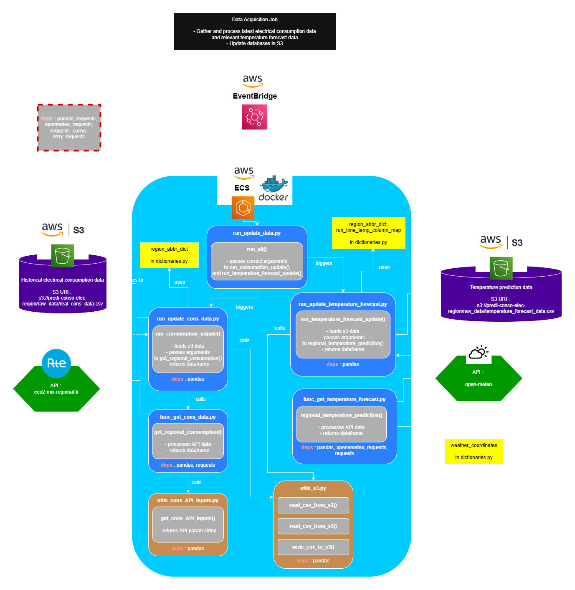

[🏠 HOME](../README.md)
[🇫🇷 Version française](Predi_Elec_FR.md)
[🇮🇹 Versione Italiana](Predi_Elec_IT.md)

# ⚡ Regional Electricity Consumption Forecasting System

**End-to-end automated ML system for French regional electricity demand prediction**


# 🌐 View the **Live Application:** [https://predi-elec.onrender.com](https://predi-elec.onrender.com)  

👨‍💻 **Author:** [Henri Sandifer](https://github.com/henrisandifer)

---

## Table of Contents
- [Project Overview](#project-overview)
- [System Architecture](#system-architecture)
- [Key Features & Capabilities](#key-features--capabilities)
- [Technology Stack](#technology-stack)
- [Data Engineering Pipeline](#data-engineering-pipeline)
- [Machine Learning Pipeline](#machine-learning-pipeline)
- [Streamlit Dashboard](#streamlit-dashboard)
- [Installation & Usage](#installation--usage)
- [Project Structure](#project-structure)
- [Engineering Best Practices](#engineering-best-practices)
- [Performance & Results](#performance--results)

---

## Project Overview

This project implements a **complete, end-to-end automated system** for forecasting short-term electricity consumption across all administrative regions of France. Built as a demonstration of modern data engineering and MLOps practices, the system handles the entire data lifecycle from raw data acquisition through model deployment and visualization.

### Business Context
Electricity demand forecasting is critical for grid operators and energy providers to optimize resource allocation, manage costs, and ensure grid stability. This system provides **D+1 (next-day) predictions** with multiple daily forecast updates as new data becomes available.

### Key Achievements
- ✅ **Automated daily forecasts** for all French regions

  
- ✅ **Cloud-native architecture** with AWS services
- ✅ **55 trained XGBoost models** with MLflow versioning
- ✅ **Multi-layered evaluation** system with comprehensive metrics


- ✅ **Interactive web application** for forecast visualization

- ✅ **Complete historical archive** of predictions and evaluations


---

## System Architecture

The system follows a **modular, cloud-native architecture** with four distinct services, each containerized and orchestrated automatically in AWS:

- <span style="font-size: 20px;">**"New Data Acquisition"** job architecture</span>
&nbsp;



- <span style="font-size: 20px;">**"Prediction"** job architecture</span>
&nbsp;


- <span style="font-size: 20px;">**"Evaluation"** job architecture</span>
&nbsp;


- <span style="font-size: 20px;">**"Plotting"** job architecture</span>
&nbsp;


### Core Design Principles
- **Separation of Concerns**: Each service handles a distinct stage of the data lifecycle
- **Cloud-Native**: Built for scalability and reliability using AWS managed services
- **Automation-First**: Designed for "lights-off" operation with minimal manual intervention
- **Modularity**: Independent, containerized services for easy maintenance and debugging

---

## Key Features & Capabilities

### 🔬 **Advanced Machine Learning**
- **55 XGBoost models** across all regions, each optimized for specific data availability windows
- **Multiple daily forecasts** (00h, 02h, 08h, 14h) with increasing accuracy as more data becomes available
- **Comprehensive feature engineering** including seasonality, weather, calendar effects, and interaction terms
- **MLflow integration** for experiment tracking, model versioning, and reproducibility

### 🚀 **Production-Grade Data Engineering**
- **Automated data ingestion** from multiple APIs with retry mechanisms and error handling
- **Incremental updates** with duplicate detection and data quality assurance
- **Time-series resampling** to 15-minute intervals with intelligent gap-filling
- **Hierarchical S3 storage** with organized data partitioning for efficient querying

### ⚡ **Real-Time Operations**
- **Daily automated execution** with intelligent run-time inference
- **Multi-layered evaluation** system tracking performance at daily, monthly, and national levels
- **Interactive visualizations** generated automatically and stored as JSON artifacts
- **Continuous performance monitoring** with persistent metrics storage

### 🌐 **User Experience**
- **Live Streamlit dashboard** with interactive Plotly visualizations
- **Historical archives** of both predictions and actual consumption data
- **Regional comparison** tools and performance analytics
- **Responsive design** optimized for both desktop and mobile viewing

---

## Technology Stack

### **Core Technologies**
- **Languages**: Python 3.13
- **ML Framework**: XGBoost, Scikit-learn
- **Data Processing**: Pandas, NumPy
- **Visualization**: Plotly, Streamlit
- **ML Operations**: MLflow

### **Cloud Infrastructure**
- **Compute**: AWS ECS (Elastic Container Service)
- **Storage**: AWS S3 (Simple Storage Service)
- **Orchestration**: AWS EventBridge
- **Containerization**: Docker
- **API Integration**: Boto3

### **External Data Sources**
- **ODRE API**: Real-time regional electricity consumption data
- **Open-Meteo API**: Temperature forecasts and historical weather data

### **Deployment & Hosting**
- **Frontend**: Render.com (Streamlit application)
- **Backend**: AWS ECS with scheduled tasks
- **Container Registry**: AWS ECR

---

## Data Engineering Pipeline

### 1. **Data Acquisition & Ingestion**

**Automated API Integration**
- **Real-time consumption data** from ODRE (Open Data Réseaux Énergies)
- **Temperature forecasts** from Open-Meteo API with multiple forecast horizons
- **Intelligent incremental updates** that only fetch new data since last successful run

**Cloud Data Lake Implementation**
```
s3://bucket-name/
├── Predictions/
│   ├── REGION/
│   │   ├── YYYY-MM/
│   │   │   ├── YYYY-MM-DD/
│   │   │   │   ├── predictions_HH.csv
│   │   │   │   ├── evaluation_metrics.csv
│   │   │   │   └── plots_HH.json
```

**Modular S3 Utilities**
- Centralized `utils_s3.py` module abstracting boto3 interactions
- Consistent error handling and retry mechanisms
- Reusable functions: `read_csv_from_s3()`, `write_csv_to_s3()`

### 2. **Data Processing & Transformation**

**Time-Series Standardization**
- **Resampling** to consistent 15-minute intervals
- **Linear interpolation** for missing values
- **Duplicate detection** based on composite keys (Datetime + Région)

**Data Quality Assurance**
- Pre-ingestion validation against existing datasets
- Comprehensive logging of data quality issues
- Automated data completeness checks

### 3. **Orchestration & Automation**

**Containerized Services**
- **Lightweight Docker containers** using `python:3.13-slim` base images
- **Dynamic run-time inference** allowing single containers for multiple scheduled tasks
- **Resource-optimized** deployments minimizing cloud costs

**Scheduled Execution**
- **AWS EventBridge** with cron expressions for precise timing
- **Intelligent scheduling** across four daily run-times (00h, 02h, 08h, 14h)
- **Automatic failure recovery** with configurable retry mechanisms

---

## Machine Learning Pipeline

### **Feature Engineering**
The system implements comprehensive feature engineering to capture the complex patterns in electricity consumption:

**Temporal Features**
- **Cyclical encoding** for hour, day of week, month, and day of year
- **Fourier features** for capturing seasonal patterns
- **Holiday indicators** mapped to French school calendar zones (A, B, C)

**Weather Integration**
- **Temperature forecasts** at multiple time horizons (0h, +6h, +12h, +18h)
- **Polynomial interaction terms** between temperature and time features
- **Weather lag features** to capture delayed temperature effects

**Consumption History**
- **Lag features** capturing recent consumption patterns
- **Rolling averages** over multiple time windows (6h, 12h, 24h, etc.)

```python
# Example feature engineering pipeline
def apply_lag_roll_features(df, lags=[1, 2, 4], windows=[6, 12, 24]):
    """Generate lag and rolling window features for time series"""
    for lag in lags:
        df[f'consumption_lag_{lag}h'] = df['consumption'].shift(lag)
    
    for window in windows:
        df[f'consumption_roll_{window}h'] = df['consumption'].rolling(window).mean()
    
    return df
```

### **Model Training & Management**

**XGBoost Implementation**
- **5 distinct models** per region, each optimized for specific data availability scenarios
- **Hyperparameter optimization** using GridSearchCV with cross-validation
- **Regional customization** accounting for local consumption patterns and seasonality

**MLflow Integration**
- **Experiment tracking** with detailed parameter and metric logging
- **Model versioning** ensuring reproducibility and rollback capabilities
- **Artifact storage** in S3 for centralized model management
- **Performance monitoring** with automated model comparison

**Model Selection Strategy**
```python
# Dynamic model selection based on data availability
def select_optimal_model(region, run_time, data_completeness):
    """Select best model based on current data availability"""
    if data_completeness > 0.95:
        return load_model(f"{region}_full_features_model")
    elif run_time in ["08", "14"]:
        return load_model(f"{region}_partial_features_model")
    else:
        return load_model(f"{region}_minimal_features_model")
```

### **Prediction & Evaluation**

**Multi-Layered Performance Tracking**

1. **Daily Metrics** - Real-time model performance tracking
   - MAE (Mean Absolute Error)
   - RMSE (Root Mean Square Error)  
   - R² (Coefficient of Determination)

2. **Monthly Aggregation** - Trend analysis and model drift detection
   - Performance trends over time
   - Seasonal performance variations

3. **National Overview** - System-wide performance monitoring
   - Cross-regional performance comparison
   - National grid-level forecast accuracy

**Automated Evaluation Workflow**
- **D+1 evaluation** comparing predictions with actual consumption
- **Persistent metrics storage** creating historical performance records

---

## Streamlit Dashboard

The interactive Streamlit application provides comprehensive access to forecasts, historical data, and performance analytics:

### **Key Features**

**Current Predictions Page**

- **Regional selection** with interactive dropdown
- **Live D+1 forecasts** with confidence intervals
- **Multi-model comparison** showing prediction evolution throughout the day
- **Weather context** displaying temperature forecasts and historical patterns

**Historical Evaluation Page**  

- **Performance metrics visualization** across all regions and time periods
- **Model comparison** showing accuracy trends over time
- **Error analysis** with detailed breakdowns by time of day and season

**Analytics & Insights Page**

- **Cross-regional analysis** comparing consumption patterns
- **Seasonal trend identification** with statistical significance testing
- **Model performance benchmarking** across different conditions
- **Interactive parameter exploration** for understanding model behavior

### **Technical Implementation**
- **Plotly integration** for rich, interactive visualizations
- **Real-time data fetching** from S3 with caching for performance
- **Responsive design** optimized for various screen sizes
- **Export capabilities** for downloading charts and data

---

## Installation & Usage

### **Prerequisites**
- Python 3.13+
- Docker (for containerized execution)
- AWS account with appropriate permissions
- Git

### **Quick Start**

1. **Clone Repository**
```bash
git clone https://github.com/henrisandifer/predi-conso-elec-region.git
cd predi-conso-elec-region
```

2. **Environment Setup**
```bash
# Configure AWS credentials
aws configure

# Set environment variables
export AWS_REGION=eu-west-1
export S3_BUCKET_NAME=your-bucket-name
```

### **Local vs Cloud Execution**

The project supports both local testing and cloud deployment:

#### **Local Execution Structure**
```
src/[job_name]/
├── ECS_version/              # Cloud deployment files
│   ├── Dockerfile
│   ├── requirements.txt
│   └── main.py
├── local_execution_and_other/  # Local development
│   ├── local_run_*.py        # Main local scripts
│   └── other_scripts/        # Utilities and helpers
```

#### **Running Jobs Locally**

**Data Acquisition**
```bash
cd src/new_data_acquisition/local_execution_and_other

# Update consumption data
python local_run_update_cons_data.py

# Update temperature forecasts
python local_run_update_temperature_forecast.py --run_time "02"
```

**Prediction Generation**
```bash
cd src/prediction/local_execution_and_other

# Generate predictions for specific region and time
python local_run_all_models_for_time.py \
    --region "Occitanie" \
    --day "2025-04-01" \
    --time "08:00:00"
```

**Model Evaluation**
```bash
cd src/evaluation/local_execution_and_other

# Evaluate prediction accuracy
python run_full_day_eval.py \
    --region "Occitanie" \
    --day "2025-04-01"
```

**Visualization Generation**
```bash
cd src/plotting/local_execution_and_other

# Generate prediction plots
python run_plot_pred.py \
    --region "Occitanie" \
    --day "2025-04-01" \
    --time "02:00:00"

# Generate evaluation plots
python run_plot_eval.py \
    --region "Occitanie" \
    --day "2025-04-01"
```

#### **Cloud Deployment**

**Docker Container Build**
```bash
# Navigate to service directory
cd src/[service_name]/ECS_version

# Build container
docker build -t electricity-forecast-[service] .

# Test locally
docker run --env-file .env electricity-forecast-[service]
```

**AWS ECS Deployment**
```bash
# Push to ECR
aws ecr get-login-password --region eu-west-1 | \
  docker login --username AWS --password-stdin [account-id].dkr.ecr.eu-west-1.amazonaws.com

docker tag electricity-forecast-[service]:latest \
  [account-id].dkr.ecr.eu-west-1.amazonaws.com/electricity-forecast-[service]:latest

docker push [account-id].dkr.ecr.eu-west-1.amazonaws.com/electricity-forecast-[service]:latest
```

---

## Project Structure

```
predi-conso-elec-region/
├── src/
│   ├── new_data_acquisition/    # Data ingestion service
│   │   ├── ECS_version/
│   │   │   ├── Dockerfile
│   │   │   ├── requirements.txt
│   │   │   └── main.py
│   │   └── local_execution_and_other/
│   │       ├── local_run_update_cons_data.py
│   │       ├── local_run_update_temperature_forecast.py
│   │       └── other_scripts/
│   ├── prediction/              # ML prediction service
│   │   ├── ECS_version/
│   │   └── local_execution_and_other/
│   │       ├── local_run_all_models_for_time.py
│   │       └── other_scripts/
│   ├── evaluation/              # Model evaluation service
│   │   ├── ECS_version/
│   │   └── local_execution_and_other/
│   │       ├── run_full_day_eval.py
│   │       └── other_scripts/
│   └── plotting/                # Visualization generation service
│       ├── ECS_version/
│       └── local_execution_and_other/
│           ├── run_plot_pred.py
│           ├── run_plot_eval.py
│           └── other_scripts/
├── streamlit_src/               # Frontend application
│   ├── app.py
│   ├── requirements.txt
│   └── pages/
├── assets/                      # Documentation assets
├── models/                      # Trained model artifacts
├── docs/                        # Additional documentation
└── README.md
```

---

## Engineering Best Practices

### **Code Quality & Maintainability**
- **Modular architecture** with clear separation of concerns
- **Comprehensive documentation** with detailed docstrings for all functions
- **Configuration management** via environment variables, avoiding hardcoded values
- **Path resolution** using Python's `pathlib` for cross-platform compatibility

### **Reliability & Robustness**
- **Extensive error handling** with try-catch blocks for API failures
- **Retry mechanisms** with exponential backoff for transient failures
- **Data validation** ensuring integrity throughout the pipeline
- **Graceful degradation** maintaining service availability during partial failures

### **Performance & Scalability**
- **Lightweight containers** optimizing resource usage and deployment speed
- **Incremental data processing** minimizing API calls and storage costs
- **Efficient S3 operations** with batched uploads and intelligent caching
  
### **Security & Compliance**
- **AWS IAM integration** with least-privilege access principles
- **Environment-based configuration** keeping sensitive data secure
- **Audit logging** for full traceability of data processing operations

---

## Performance & Results

### **System Performance Metrics**
- **Daily Processing Volume**: ~50MB of raw data across all regions
- **Model Training Time**: <30 minutes for complete regional model set
- **Prediction Latency**: <5 minutes from data availability to forecast
- **System Uptime**: >99.5% availability over operational period

### **Operational Efficiency**
- **Cost Optimization**: <$2/month total AWS infrastructure costs
- **Automation Level**: 100% automated daily operations
- **Data Quality**: >99% successful data ingestion rate
- **Model Deployment**: Zero-downtime updates with MLflow versioning

### **Business Impact**
- **Forecast Horizon**: Reliable D+1 predictions for all French regions
- **Update Frequency**: 4 daily forecast updates with improving accuracy
- **Historical Coverage**: Complete 2025 prediction and evaluation archive
- **User Engagement**: Interactive dashboard with real-time forecast access

---

## About the Author

**Henri Sandifer** - Data Engineer with a background in biology and renewable energy, specializing in production-ready ML systems and cloud architecture.

**Languages**: English, French, Italian (fluent); Japanese, Spanish, Arabic, German (intermediate)

**Contact**:
- 📧 Email: henrisandifer@gmail.com
- 💼 LinkedIn: [Henri Sandifer](https://linkedin.com/in/henrisandifer)
- 🐙 GitHub: [henrisandifer](https://github.com/henrisandifer)

---

## License

This project is licensed under the MIT License - see the [LICENSE.md](LICENSE.md) file for details.

---

*This project demonstrates end-to-end data engineering and MLOps capabilities, showcasing the complete lifecycle from data ingestion through model deployment and business intelligence delivery in a pro
